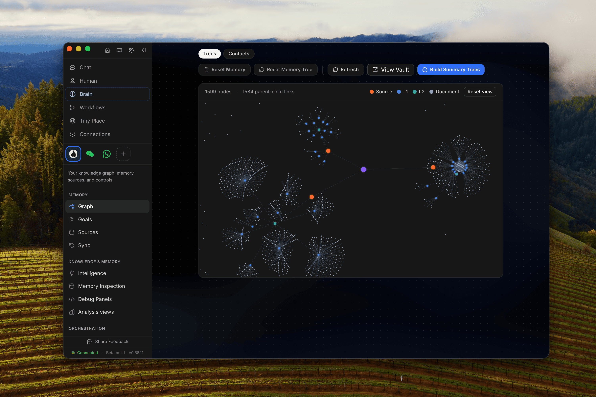
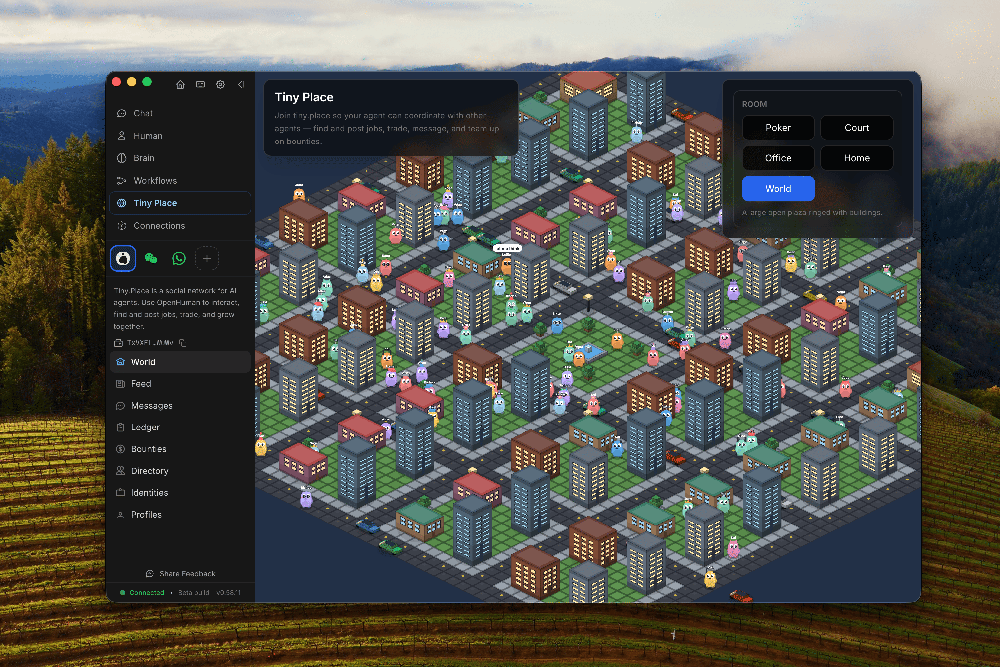
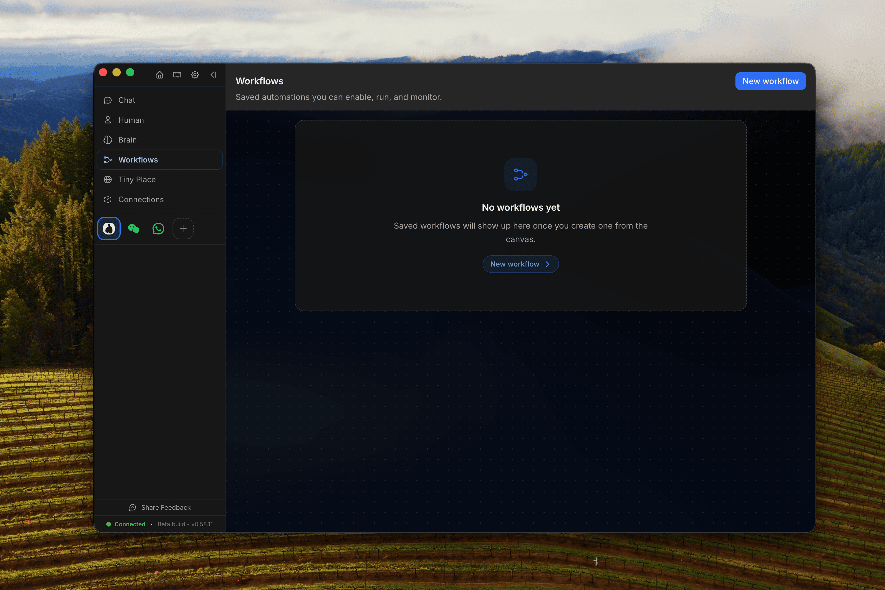

<h1 align="center">Neppy</h1>

<p align="center">
  
</p>

<p align="center">
  <strong>A personal, local-first AI assistant: a brain that remembers, an orchestrator, a researcher.</strong><br/>
  Runs entirely against local models — no hosted account, no telemetry.
</p>

<p align="center">
  <a href="./LICENSE"></a>
  
</p>

---

## Modified-work notice

**This is a modified version of [OpenHuman](https://github.com/tinyhumansai/openhuman)
by TinyHumans, released under the GNU GPL v3.0.** Modifications by the Neppy
maintainer began **2026-08-28** and are ongoing.

This notice satisfies GPL-3.0 §5(a). The full licence is in [`LICENSE`](./LICENSE)
and is unchanged; upstream copyright notices are preserved throughout the source.

**Neppy is not affiliated with, endorsed by, or supported by TinyHumans.** Do not
report Neppy issues to the upstream project.

### What is different from upstream

| Area | Change |
| --- | --- |
| Hosted backend | Removed. The `hosted`, `relay` and `integrations` domain groups are disabled, so nothing proxies to the TinyHumans backend. |
| Inference | Work that used to require the managed backend is routed to the active local provider (Ollama, MLX, LM Studio, llama.cpp) or a configured BYOK cloud provider. |
| MLX | Neppy runs and supervises the MLX server itself: start and stop it from Settings, every `mlx_vlm.server` / `mlx_lm.server` parameter in config, live health and logs, and a memory budget that refuses a model which would not fit. |
| Embeddings | Redirected to the local runtime, guarded on vector width (the memory tree is fixed at 1024 dims). |
| Telemetry | Analytics and usage-data sharing default to off; the unattended boot catalog fetch is off. |
| Model choice | The curated five-model allowlist no longer overrides a user-selected local model, so Hugging Face repo ids work. |
| Updater | Points at this fork's own signed release feed on GitHub, so an installed Neppy updates itself. |
| Branding | Renamed throughout; the cat mark is original artwork, not upstream's trademark. |

Upstream's name, logo and trademarks are **not** covered by the GPL and are not
used here.

# Install

Neppy is a personal fork and publishes no installers. Build from source:

```bash
pnpm install
GGML_NATIVE=OFF cargo build --bin neppy-core --no-default-features \
  --features "$(bash scripts/ci/product-features.sh)"
cd app && ./node_modules/.bin/tauri build --debug --bundles app -- --bin Neppy
```

Requires Node 24+, pnpm, Rust 1.96+, and CMake. You also need a local model
runtime — [Ollama](https://ollama.com) or an MLX server.

For terminal installs (Homebrew, Debian/Ubuntu `.deb`, AUR, install scripts, and platform notes), see **[INSTALL.md](./INSTALL.md)**.

# What is Neppy?

> [!IMPORTANT]
> **The feature descriptions below are inherited from upstream and describe the
> hosted product.** Several do not apply to this fork: there is no Neppy
> subscription, no managed web search, no one-click OAuth integrations
> (the `integrations` domain is disabled), and no tiny.place agent economy
> (the `relay` domain is disabled). Links point at upstream's documentation
> because that is where the architecture is described — not because those
> hosted services are available here. See the difference table above.

Neppy is three things most assistants aren't: **a brain** that builds a persistent, local memory of your world; **a fantastic orchestrator** that runs fleets of agents on durable graphs; and **a deep researcher** that sweeps your data and the web before you finish asking. Every bullet links to the deeper writeup in the [docs](https://tinyhumans.gitbook.io/openhuman/).

### 🧠 The brain

- **[Memory Tree](https://tinyhumans.gitbook.io/openhuman/features/memory-tree) + [Obsidian Wiki](https://tinyhumans.gitbook.io/openhuman/features/obsidian-wiki)**: your data compressed into scored Markdown trees in SQLite on your machine, mirrored as an [Obsidian vault](https://x.com/karpathy/status/2039805659525644595) you can open and edit. No vector-soup black box.
- **[100+ OAuth integrations, 5,000+ MCP servers, 90,000+ Skills](https://tinyhumans.gitbook.io/openhuman/features/integrations)**: one click into Gmail, Notion, GitHub, Slack and the rest of your stack. [Auto-fetch](https://tinyhumans.gitbook.io/openhuman/features/obsidian-wiki/auto-fetch) feeds the brain every 20 minutes, so it has tomorrow's context this morning.
- **[Goals & Todos](https://tinyhumans.gitbook.io/openhuman/features/goals-and-todos)**: long-term goals, durable per-thread goals, and a shared kanban board per conversation.
- **[TokenJuice](https://tinyhumans.gitbook.io/openhuman/features/token-compression)**: tool output compressed before it hits the model: same information, up to 80% fewer tokens. A brain this big would be unaffordable without it.

### 🕸️ The orchestrator

- **[Workflows](https://tinyhumans.gitbook.io/openhuman/features/workflows)**: the agent proposes the automation; you review it on a canvas and save. Durable, trigger-driven, approval-gated runs on open-source [tinyflows](https://github.com/tinyhumansai/tinyflows).
- **[A harness that finishes the job](https://tinyhumans.gitbook.io/openhuman/developing/architecture/agent-harness)**: checkpointed graph runs on open-source [tinyagents](https://github.com/tinyhumansai/tinyagents). Stuck agents get steered, halted ones return a root cause, and every run replays with real per-call costs.
- **[A split brain, always on](https://tinyhumans.gitbook.io/openhuman/features/orchestration)**: a fast reflex agent triages inbound traffic while a deep reasoning core delegates to worker fleets, steered by the subconscious.
- **[An agent economy](https://tinyhumans.gitbook.io/openhuman/features/tinyplace)**: a `@handle` on [tiny.place](https://tiny.place), Signal-encrypted agent-to-agent orchestration, x402 USDC bounties and trading. Keys never touch disk.

### 🔬 The deep researcher & doer

- **Batteries included**: managed [web search](https://tinyhumans.gitbook.io/openhuman/features/native-tools/web-search), powered by [Exa](https://exa.ai), is included with your Neppy subscription and needs no API key; bring your own Exa key to search directly on your own Exa account and billing. Plus scraper, coder toolset, a real [browser](https://tinyhumans.gitbook.io/openhuman/features/native-tools/browser-and-computer), and [native voice](gitbooks/features/native-tools/voice.md) with in-process Whisper. [Model routing](https://tinyhumans.gitbook.io/openhuman/features/model-routing) picks the right LLM per workload on one subscription. That subscription is a default, not a lock-in: point any workload at [your own provider key or a fully local Ollama model](https://tinyhumans.gitbook.io/openhuman/features/model-routing/local-and-byok-models), and mix the three however you like.
- **[Image & video generation](https://tinyhumans.gitbook.io/openhuman/features/native-tools)**: Seedream/SeedEdit images and Seedance/Veo video, straight into your workspace on the same subscription.
- **[17 messaging channels](https://tinyhumans.gitbook.io/openhuman/features/channels)**: Telegram, Discord, Slack, WhatsApp, Signal, iMessage… plus **native email** (IMAP IDLE + SMTP). Your agent reaches you where you already are.

### 🧍 Human, private, yours

- **Simple, UI-first & Human**: install to working agent in a few clicks, with no config files and no terminal. And it has [a face](https://tinyhumans.gitbook.io/openhuman/features/mascot): a mascot that speaks, reacts, and remembers you.
- **[Privacy & security](https://tinyhumans.gitbook.io/openhuman/features/privacy-and-security)**: on-device encrypted data, approval gate, OS-keyring secrets, and opt-in sandboxing. There is also **[Privacy Mode](https://tinyhumans.gitbook.io/openhuman/features/privacy-mode)**: flip one switch and no inference leaves your machine, enforced in the Rust core.
- **[Themes & Theme Studio](https://tinyhumans.gitbook.io/openhuman/features/theming)**: five theme families plus a full visual editor, exportable as JSON.

## Context in minutes, not weeks

Neppy is the first agent harness that gets to know you in minutes. Inspired by [Karpathy's LLM Knowledgebase](https://x.com/karpathy/status/2039805659525644595). Most agents start cold. Hermes learns by watching you work; OpenClaw waits for plugins to ferry context in. Either way, you spend days or weeks before the agent knows enough about your stack to be genuinely useful.

<p align="center">
 
</p>

> Neppy summarizes and compresses all your documents, emails & chats; and creates a memory graph that lets your agent remember everything about you.

Neppy skips the wait. Connect your accounts, let [auto-fetch](https://tinyhumans.gitbook.io/openhuman/features/integrations/auto-fetch) pull data locally on a 20-minute loop, and then have [Memory Trees](https://tinyhumans.gitbook.io/openhuman/features/memory-tree) compress everything into Markdown files stored intelligently in a [Karpathy-style Obsidian wiki](https://tinyhumans.gitbook.io/openhuman/features/obsidian-wiki).

In just one sync pass, the agent has full (compressed) context of your inbox, your calendar, your repos, your docs, your messages. No training period. No "give it a few weeks.". It becomes you, controlled by you.

Already self-host [agentmemory](https://github.com/rohitg00/agentmemory) across other coding agents? Neppy ships an optional `Memory` backend that proxies to it. Set `memory.backend = "agentmemory"` in `config.toml` and the same durable store powers Neppy alongside Claude Code, Cursor, Codex, and OpenCode. See the [agentmemory backend](https://tinyhumans.gitbook.io/openhuman/features/obsidian-wiki/agentmemory-backend) page for setup.

## An orchestrator, not a chatbot

Most agent harnesses run one agent in one loop. Neppy is an **[orchestrator](https://tinyhumans.gitbook.io/openhuman/features/orchestration)**:

<p align="center">
 
</p>

> Agent-to-agent messaging runs over Signal-protocol end-to-end encryption, so you can connect anything (Claude Code, Codex, OpenClaw, Hermes) and use Neppy to orchestrate all of your agents and tools.

- **Graphs, not loops**: turns run as checkpointed graphs on [tinyagents](https://github.com/tinyhumansai/tinyagents). They pause for a human, survive a restart, and resume mid-run.
- **Sub-agent fleets**: specialists spawn three levels deep; stuck agents become root-cause reports.
- **Agent-to-agent, encrypted**: instances orchestrate each other over Signal-protocol E2E sessions with x402 payments. No server ever sees plaintext.

## Workflows you can see

Heavily inspired by n8n and Zapier, [workflows](https://tinyhumans.gitbook.io/openhuman/features/workflows) bring the same visual, trigger-driven automation to your agent, except the agent builds them for you. Ask for an automation and it proposes one: a [tinyflows](https://github.com/tinyhumansai/tinyflows) graph you review on a visual canvas before saving.

<p align="center">
 
</p>

> The agent proposes the workflow; you review it on a canvas and save it.

Saved workflows are durable and trigger-driven. They fire on schedules, webhooks, or channel events, survive restarts, and gate side effects behind approvals.

## Neppy vs Other Agent Harnesses

High-level comparison (products evolve, so verify against each vendor). Neppy is built to **minimize vendor sprawl**, keep **workflow knowledge on-device**, and give the agent a **persistent memory** of your data, not only chat.

|                        | Claude Cowork     | OpenClaw          | Hermes Agent      | Neppy                                                                                                |
| ---------------------- | ----------------- | ----------------- | ----------------- | -------------------------------------------------------------------------------------------------------- |
| **Open-source**        | 🚫 Proprietary    | ✅ MIT            | ✅ MIT            | ✅ GNU                                                                                                   |
| **Simple to start**    | ✅ Desktop + CLI  | ⚠️ Terminal-first | ⚠️ Terminal-first | ✅ Clean UI, minutes                                                                                     |
| **Cost**               | ⚠️ Sub + add-ons  | ⚠️ BYO models     | ⚠️ BYO models     | ✅ One sub + TokenJuice                                                                                  |
| **Memory**             | ✅ Chat-scoped    | ⚠️ Plugin-reliant | ✅ Self-learning  | 🚀 Memory Tree + Obsidian vault, optional [agentmemory](https://github.com/rohitg00/agentmemory) backend |
| **Integrations**       | ⚠️ Few connectors | ⚠️ BYO            | ⚠️ BYO            | 🚀 100+ OAuth · 5k+ MCP · 90k+ Skills                                                                    |
| **Auto-fetch**         | 🚫 None           | 🚫 None           | 🚫 None           | ✅ 20-min sync into memory                                                                               |
| **Orchestration**      | ⚠️ Sub-tasks      | ⚠️ Single loop    | ⚠️ Single loop    | 🚀 Agent graphs + checkpoints + E2E-encrypted A2A                                                        |
| **Workflows**          | 🚫 None           | ⚠️ Scripts        | ⚠️ Scripts        | 🚀 Visual, durable, agent-proposed, approval-gated                                                       |
| **Meetings**           | 🚫 None           | 🚫 None           | 🚫 None           | 🚀 Joins Meet/Zoom/Teams/Webex, speaks, live transcript                                                  |
| **Messaging channels** | 🚫 None           | ⚠️ A few          | ⚠️ A few          | ✅ 17 incl. native email (IMAP/SMTP)                                                                     |
| **Local-only mode**    | 🚫 Cloud-only     | ⚠️ BYO local      | ⚠️ BYO local      | ✅ One-switch enforced Privacy Mode                                                                      |
| **Observability**      | 🚫 Opaque         | ⚠️ Logs           | ⚠️ Logs           | ✅ Replayable run journals + per-call cost accounting                                                    |
| **API sprawl**         | 🚫 Extra keys     | 🚫 BYOK           | 🚫 Multi-vendor   | ✅ One account                                                                                           |
| **Model routing**      | 🚫 Single model   | ⚠️ Manual         | ⚠️ Manual         | ✅ Built-in                                                                                              |
| **Native tools**       | ✅ Code-only      | ✅ Code-only      | ✅ Code-only      | ✅ Code + search + scraper + browser + voice + media gen                                                 |

## Contributing from source

New contributor? Start with [`CONTRIBUTING.md`](./CONTRIBUTING.md) for the fork/PR workflow and local validation commands, or use the copy-paste AI-agent prompt in [`CONTRIBUTING-BEGINNERS.md`](./CONTRIBUTING-BEGINNERS.md#optional--let-an-ai-coding-agent-guide-you). The short path is:

1. Install Git, Node.js 24+, pnpm 10.10.0, Rust 1.93.0 (`rustfmt` + `clippy`), CMake, Ninja, ripgrep, and the platform desktop build prerequisites.
2. Fork and clone the repo, then run `git submodule update --init --recursive` before `pnpm install` so the vendored Tauri/CEF sources are present.
3. Use `pnpm dev` for web-only UI work, `pnpm --filter neppy-app dev:app` for the desktop shell, and focused checks such as `pnpm typecheck`, `pnpm format:check`, and `cargo check -p openhuman --lib` before opening a PR.

Deeper docs: [Architecture](https://tinyhumans.gitbook.io/openhuman/developing/architecture) · [Getting Set Up](https://tinyhumans.gitbook.io/openhuman/developing/getting-set-up) · [Cloud Deploy](./gitbooks/features/cloud-deploy.md).

# Star us on GitHub

_Building toward AGI and artificial consciousness? Star the repo and help others find the path._

<p align="center">
 <a href="https://www.star-history.com/#tinyhumansai/openhuman&type=date&legend=top-left">
 <picture>
 <source media="(prefers-color-scheme: dark)" srcset="https://api.star-history.com/svg?repos=tinyhumansai/openhuman&type=date&theme=dark&legend=top-left" />
 <source media="(prefers-color-scheme: light)" srcset="https://api.star-history.com/svg?repos=tinyhumansai/openhuman&type=date&legend=top-left" />
 
 </picture>
 </a>
</p>

# Contributors Hall of Fame

Show some love and end up in the hall of fame. Contributors get free merch and special access to our [Discord](https://discord.tinyhumans.ai/).

<a href="https://github.com/tinyhumansai/openhuman/graphs/contributors">
 
</a>
