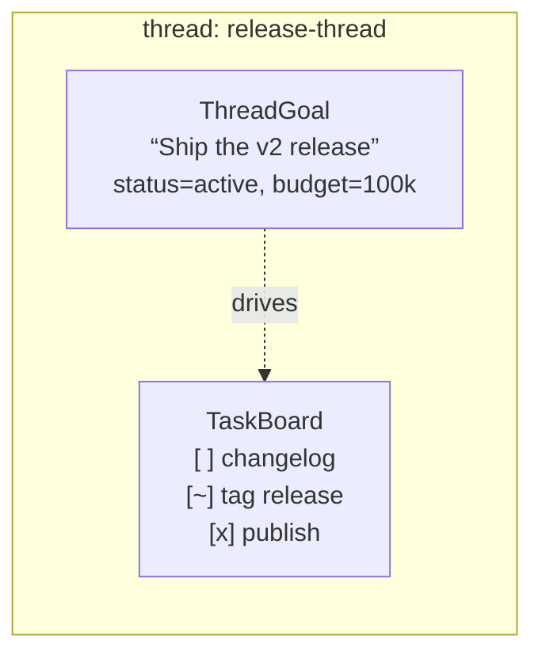
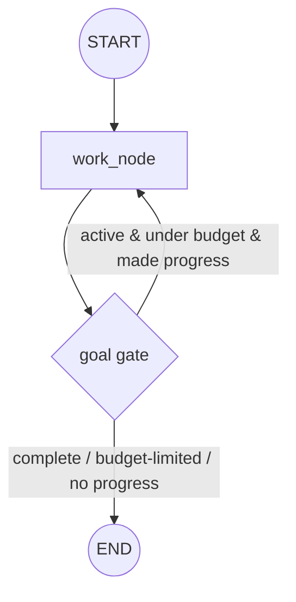
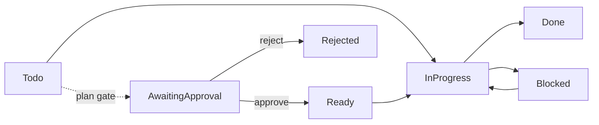

# Goals and Todos

The graph runtime ships two **per-thread productivity primitives** — a durable
**goal** (`graph::goals`) and a kanban **task board** (`graph::todos`). They let
a graph or agent carry intent across turns: *what* it is trying to achieve (one
objective) and *the concrete steps* it is working through (a list of cards).
Both are provider-neutral, offline-testable, and persist on the same
[`harness::store::Store`](Harness.md) abstraction the rest of the crate uses.

They are the Rust-native descendants of OpenHuman's `thread_goals` and task
board, minus the app-specific coupling (event bus, RPC envelopes, heartbeat
scheduler): the primitives are pure runtime state plus harness tools, driven off
the [Graph Runtime](Graph-Runtime.md).

- **Goal** — exactly one durable objective *per thread* (a "completion
  contract"). A model creates/replaces it, works it across turns, and marks it
  complete.
- **Task board** — an ordered *list* of task cards per thread, with a small
  kanban lifecycle and a single-`in_progress` invariant.

A goal is the intent; the board holds the work items. They are independent (no
code-level containment) but pair naturally: both keyed by the same `thread_id`,
persisted side by side.



---

## graph::goals — the per-thread goal

### Data model

A [`ThreadGoal`] is one objective per thread with a small lifecycle:

| Status | Meaning |
| --- | --- |
| `Active` | The graph may make progress and (when driven) auto-continue. |
| `Paused` | Suspended by a host; the objective persists, reactivated on resume. |
| `BudgetLimited` | The token budget was reached; substantive work halts. |
| `Complete` | Evidence confirms the objective is satisfied. |

Ownership is **asymmetric**: a model may create/replace a goal and mark it
`Complete`; `Paused` / `BudgetLimited` are system-driven (host control and
accounting). The goal carries an optional `token_budget`, cumulative
`tokens_used` / `time_used_seconds`, and a `continuation_suppressed` one-shot
flag (see [Continuation](#continuation-heartbeat--graph)).

```rust
use std::sync::Arc;
use tinyagents::goal_store;
use tinyagents::harness::store::{InMemoryStore, Store};

let store: Arc<dyn Store> = Arc::new(InMemoryStore::default());

// Create or replace the thread's objective, with a token budget.
let goal = goal_store::set(&store, "thread-1", "Ship the v2 release", Some(100_000)).await?;
assert_eq!(goal.status.as_str(), "active");

// Read it back; mark complete when the objective is met.
let current = goal_store::get(&store, "thread-1").await?.unwrap();
goal_store::complete(&store, "thread-1").await?;
```

`set` mints a fresh `goal_id` and resets counters when the objective **changes**;
a same-objective re-set preserves counters and re-opens to `Active` (unless still
over budget). `account_usage` folds token/time usage and flips an active goal to
`BudgetLimited` at the cap; its `expected_goal_id` **compare-and-set** guard
silently drops stale accounting from a goal that was already replaced.

### Tools

`goal_get`, `goal_set`, and `goal_complete` are the default model-facing tools
(`goal_tools` / `register_goal_tools`); `goal_pause` / `goal_resume` /
`goal_clear` are host controls. The target thread is resolved from the tool
execution context — never a tool argument — so a model cannot address another
thread's goal.

```rust
use tinyagents::register_goal_tools;
use tinyagents::harness::runtime::AgentHarness;

let mut harness: AgentHarness<()> = AgentHarness::new();
register_goal_tools(harness.tools_mut(), store.clone()); // goal_get/goal_set/goal_complete
```

### Continuation (heartbeat → graph)

The interesting part: how a stored goal keeps *driving work*. OpenHuman used an
out-of-band heartbeat that injected one continuation turn when an active goal
went idle. TinyAgents has no heartbeat and no ambient agent, so the same
behaviour is re-expressed **on the graph runtime**, three ways.

#### 1. `goal_gate_node` (primary) — a self-driving bounded loop

A command-routing node you wire as `work_node → gate`, with the gate registered
as a command node whose destinations are `[work_node, END]`. After each work
iteration the gate folds the iteration's usage, then routes back to the work node
while the goal is Active and under budget, else to `END`.



Each gate activation:

1. reads the `thread_id` from the `NodeContext` (absent → `END`);
2. loads the goal (`None` → `END`);
3. folds the just-finished iteration's `GoalProgress` via `account_usage`
   (flips an over-budget goal to `BudgetLimited`);
4. routes one `goto`:
   - not Active, or `continuation_suppressed` → `END`;
   - the iteration made **no** progress → set the one-shot suppression, then
     `END`;
   - otherwise → back to `work_node` (loop).

The graph's `recursion_limit` is the hard backstop, so the loop can never spin
forever. `made_progress == false` is the graph analogue of OpenHuman's "the turn
produced no tool calls".

```rust
use tinyagents::{goal_gate_node, GoalProgress, GraphBuilder, END};

let gate = goal_gate_node::<St, St>(store.clone(), "work", |s: &St| GoalProgress {
    tokens_used: s.last_turn_tokens,
    elapsed_secs: 0,
    made_progress: s.made_progress,
});

let graph = GraphBuilder::<St, St>::overwrite()
    .with_recursion_limit(64)
    .add_node("work", work_node)   // e.g. a subagent_node that calls goal_complete when done
    .add_node("gate", gate)
    .set_entry("work")
    .add_edge("work", "gate")
    .with_command_destinations("gate", ["work", END])
    .compile()?;

let exec = graph.run_with_thread("thread-1", St::default()).await?;
```

#### 2. `run_continuation_tick` (driver) — for an external scheduler

A faithful heartbeat port for callers that *do* have a cron/scheduler: it selects
idle, active, non-suppressed goals (oldest-idle first, capped at `max_per_tick`)
and runs one turn each through a caller-supplied closure, then accounts usage and
one-shot-suppresses a no-progress turn.

```rust
use std::time::Duration;
use tinyagents::{run_continuation_tick, TurnOutcome};

let ran = run_continuation_tick(&store, Duration::from_secs(600), 2, |goal| async move {
    // run one turn toward `goal.objective`, return what it spent
    Ok(TurnOutcome { tokens_used: 1200, elapsed_secs: 4, made_progress: true })
}).await?;
```

#### 3. `note_user_turn` — resume on user activity

Call at the start of a user-initiated run to clear the one-shot suppression and
reactivate a paused goal. A loop iteration never calls it, so it can never clear
its own suppression — that is how a user turn is distinguished from a
self-driving iteration.

### The token-accounting boundary

The graph runtime is provider-neutral and **does not meter tokens per node**, so
accounting is *explicit*: the work node (typically a
[`subagent_node`](Graph-Runtime.md#sub-agent-nodes-graphsubagent_node) whose
output carries usage) writes what it spent into `State`, and the caller's
`progress` / `run_turn` closure reports it. This is the one place the mapping
from OpenHuman is not purely mechanical.

### Single-process persistence caveat

The `Store` trait has no compare-and-set, so every mutation runs
`load → mutate → put` under a per-thread async mutex — atomic **within one
process**. Across processes sharing a `FileStore`, two concurrent
read-modify-writes can lose an update; the `goal_id` guard still prevents logical
corruption from stale accounting but not lost updates. Funnel goal mutations
through one process for multi-writer deployments.

---

## graph::todos — the per-thread task board

### Data model

A [`TaskBoard`] is an ordered list of [`TaskBoardCard`]s. Each card has a
lifecycle status and rich optional metadata (objective, plan steps, assigned
agent, allowed tools, acceptance criteria, evidence, notes, blocker, approval
mode, source metadata).



`render_markdown` renders a card list as GitHub-flavored markdown with per-status
markers — `[ ]` todo/ready, `[x]` done, `[~]` in progress, `[!]` blocked, `[?]`
awaiting approval, `[-]` rejected — plus indented metadata. `parse_status`
accepts aliases (`pending`→`Todo`, `approved`→`Ready`, …). `normalise_board`
generates missing ids, trims fields, drops empty-title cards, backfills a blocked
card's blocker from its notes, and recomputes order.

### CRUD and invariants

The `graph::todos::store` (crate-root alias `todo_store`) module is the
programmatic surface; every op returns a `TodosSnapshot` (normalised cards +
markdown):

```rust
use tinyagents::todo_store;

let snap = todo_store::add(&store, "thread-1", "Write the changelog", Default::default()).await?;
let id = snap.cards[0].id.clone();
todo_store::update_status(&store, "thread-1", &id, tinyagents::TaskCardStatus::InProgress).await?;
println!("{}", todo_store::list(&store, "thread-1").await?.markdown);
```

Ops: `add`, `edit`, `update_status`, `decide_plan`, `revise_plan`, `remove`,
`replace`, `clear`, `list`, `claim_card`, `set_session_thread`. Invariants:

- **Single in-progress** — at most one card may be `InProgress`; a violation is a
  `Validation` error on `add` / `edit` / `replace` / `claim_card`, never silently
  fixed.
- `decide_plan` only transitions an `AwaitingApproval` card (approve → `Ready`,
  reject → `Rejected`); a stale decision errors. `revise_plan` rejects every
  awaiting card and is a lenient no-op when none awaits.
- `claim_card` is an atomic compare-and-set: transition from one of `expected`
  to `target` under the lock, else reject.

### The `todo` tool

`TodoTool` is a single **multiplexer** harness tool dispatching on an `op` field
over the whole CRUD surface, so a model sees one tool. Build it with `todo_tools`
/ `register_todo_tools`. The board is bound to the tool context's thread id
(never a tool argument); domain errors (unknown id, invariant violation) are
surfaced to the model as tool errors rather than failing the run.

```rust
use tinyagents::register_todo_tools;
register_todo_tools(harness.tools_mut(), store.clone()); // exposes the `todo` tool
```

---

## Putting them together

The [`goals_and_todos` example](Examples.md) wires both on one thread: a durable
goal is the completion contract, a board holds three cards, and a
`goal_gate_node` forms a self-driving loop where each iteration advances the
board by one kanban transition and completes the goal once every card is done.

```text
cargo run --example goals_and_todos
```

```text
Running the goal-driven loop:
  → started: Write the changelog
  ✓ done: Write the changelog
  → started: Tag the release
  ✓ done: Tag the release
  → started: Publish the crate
  ✓ done: Publish the crate
  ★ all cards done → goal complete

Goal: Ship the v2 release — status=complete, tokens_used=3500/100000
```

---

## Persistence at a glance

| | Namespace | Key | Value |
| --- | --- | --- | --- |
| Goal | `graph.goals` | `hex(thread_id)` | one `ThreadGoal` |
| Board | `graph.todos` | `hex(thread_id)` | one `TaskBoard` |

Both back onto any `Store` implementation — `InMemoryStore` for tests and
prototypes, `FileStore` for durable local state, or the `sqlite`-feature backend.
Keys are hex-encoded so arbitrary thread ids stay valid across every backend.

## Testing

Both modules ship exhaustive unit tests on `InMemoryStore` (types, store
invariants, tools, and the gate loop), plus end-to-end integration tests:
`tests/e2e_graph_goals.rs` drives a self-driving goal loop until complete, and
`tests/e2e_graph_todos.rs` drives the `todo` tool through a `MockModel` agent
loop and asserts the board persists to the thread.

## See also

- [Graph Runtime](Graph-Runtime.md) — the durable executor these primitives run
  on (nodes, commands, `recursion_limit`, sub-agent nodes).
- [Harness](Harness.md) — the `Store` abstraction and the `Tool` trait both
  primitives build on.
- [Examples](Examples.md) — the runnable `goals_and_todos` example.
- Module specs: `docs/modules/graph/goals.md`, `docs/modules/graph/todos.md`, and
  the source READMEs under `src/graph/goals/` and `src/graph/todos/`.
