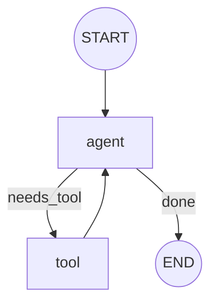
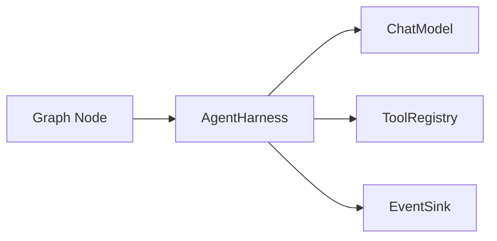

# Graph Runtime

The **graph runtime** (`src/graph/`) is TinyAgents' durable, typed workflow
engine — a LangGraph-style superstep executor where nodes read a committed state
snapshot, return partial updates, and the runtime merges, routes, checkpoints,
and (when needed) pauses for human input. It is the second of the five surfaces
in the [Architecture](Architecture.md) and the layer that makes recursion
*durable*: a graph node can embed another compiled graph, and a model standing
inside a graph can author one. See [Recursion and RLM](Recursion-and-RLM.md) for
the full recursive picture.

The graph runtime owns **structure and durability**. It does not call models or
tools itself — nodes call into the [Harness](Harness.md) when they need a model,
a tool loop, or a sub-agent. This separation keeps execution deterministic,
provider-neutral, and testable.

## Mental model

A graph is a set of named **nodes** wired by **edges**, executed in
**supersteps** over a typed **State**. Two virtual nodes bracket every run:

- `START` (`"__start__"`) — the synthetic entry; `set_entry(node)` is sugar for
  `add_edge(START, node)`.
- `END` (`"__end__"`) — the synthetic terminal; `set_finish(node)` is sugar for
  `add_edge(node, END)`.



Each superstep takes the **active node set**, runs every active node against the
*same committed snapshot*, folds their results through a **reducer** at the step
boundary, persists a **checkpoint**, then selects the next active set. The loop
stops when the active set empties, all branches reach `END`, an **interrupt**
pauses the run, or the **recursion limit** is hit.

## Building a graph: `GraphBuilder<State, Update>`

`GraphBuilder` (`graph::builder`) is generic over two types:

- `State` — the committed graph state (must be `Clone + Send + Sync + 'static`).
- `Update` — the partial-update type each node returns, merged into `State` by a
  [`StateReducer`](#typed-state-reducers-and-channels).

For the common "each node returns the whole next state" case, use
`GraphBuilder::<State, State>::overwrite()`, which installs the
`OverwriteStateReducer`:

```rust
let graph = GraphBuilder::<AgentState, AgentState>::overwrite()
    .add_node("agent", agent_node)
    .add_node("tool", tool_node)
    .set_entry("agent")
    .add_conditional_edges(
        "agent",
        |s: &AgentState| if s.needs_tool { "tool".into() } else { "done".into() },
        [("tool", "tool"), ("done", END)],
    )
    .add_edge("tool", "agent")
    .compile()?;
```

Key builder methods:

| Method | Effect |
| --- | --- |
| `add_node(id, handler)` | Register an async node returning `Result<NodeResult<Update>>`. |
| `add_edge(from, to)` | Static, unconditional edge. |
| `add_sequence(nodes)` | Chain an iterator of node ids with static edges. |
| `add_waiting_edge(from, to)` | Barrier/fan-in edge: `to` waits until all its predecessors complete. |
| `set_entry(node)` / `set_finish(node)` | `START → node` / `node → END`. |
| `add_conditional_edges(from, router, routes)` | Router closure → label table. |
| `mark_command_routing(node)` | Node routes only via `Command.goto`. |
| `with_command_destinations(node, dests)` | Advisory `goto` target hints surfaced in the export. |
| `with_node_kind(node, kind)` / `with_node_metadata(node, k, v)` | Behavior-free node annotations for export. |
| `mark_subgraph(node)` / `mark_interrupt(node)` / `mark_deferred(node)` | Tag a node as a subgraph embed, interrupt point, or deferred join. |
| `set_reducer(r)` | Install a custom `StateReducer`. |
| `set_defaults(GraphDefaults)` | Apply a bundle of policy defaults. |
| `with_recursion_limit(n)` | Cap supersteps (default **50**). |
| `with_max_concurrency(n)` | Cap concurrent branches per parallel step. |
| `with_node_timeout(duration)` | Default per-node handler timeout. |
| `with_parallel(true)` | Run multi-node supersteps concurrently (see [fan-out](#parallel-fan-out)). |
| `with_graph_id(id)` / `with_name(name)` | Override the generated graph id / set a human name. |
| `compile()` | Validate topology and freeze into a `CompiledGraph`. |

`compile()` enforces the invariants: an entry must exist, `START` cannot route
straight to `END` and cannot be an edge target, `END` cannot be an edge source,
a node cannot mix static and conditional edges, and a `mark_command_routing`
node cannot also declare static/conditional edges. Failures return
`TinyAgentsError::Validation`, `MissingStart`, `MissingNode`, etc.

## Nodes and `NodeContext`

A node handler has the shape
`Fn(State, NodeContext) -> impl Future<Output = Result<NodeResult<Update>>>`.
It receives a **clone** of the committed state and a per-task `NodeContext`:

- `node_id`, `run_id`, optional `thread_id`, and the 1-based `step`.
- `resume: Option<serde_json::Value>` — `None` on a normal run; set to the
  resume payload when an interrupted node is re-run (see [interrupts](#interrupts-and-resume)).
- `fork: Option<ForkId>` — the branch identity (`ForkId { branch_index, node }`)
  when this node runs as one fork of a concurrent superstep (`None` in
  sequential mode or single-node steps).
- `send_arg: Option<serde_json::Value>` — the per-invocation payload when this
  activation was scheduled by a `Send` packet or seeded through a `GraphInput`;
  how map-reduce / fan-out branches receive data that differs from shared state.
- `root_run_id`, `recursion_frames`, and `child_runs` — recursion-tree context:
  the shared root run id, the live `RecursionFrame` stack a subgraph node seeds
  its child with, and a `ChildRunSink` a subgraph node reports its spawned
  `ChildRun` back through (see [recursion](#recursion-policy-and-the-run-tree)).

Nodes never mutate shared state directly; they return a `NodeResult`, and the
runtime owns all state changes through the reducer.

## Node results: updates, commands, interrupts

`NodeResult<Update>` (`graph::command`) is one of three outcomes:

- `NodeResult::Update(update)` — a partial update merged through the reducer.
- `NodeResult::Command(Command)` — combine an optional `update` with explicit
  routing and/or a resume value.
- `NodeResult::Interrupt(Interrupt)` — pause for human-in-the-loop input.

A `Command<Update>` has three orthogonal fields:

```rust
pub struct Command<Update> {
    pub update: Option<Update>,   // applied before routing
    pub goto: Vec<RouteTarget>,   // overrides static/conditional edges
    pub resume: Option<serde_json::Value>, // paired with an interrupt resume
}
```

Each `goto` entry is a `RouteTarget`: either `RouteTarget::Node(id)` (activate
the node against shared state) or `RouteTarget::Send(Send { node, arg })`, which
schedules the node with a custom per-invocation argument delivered as
`NodeContext::send_arg`. `goto` is the mechanism for **dynamic routing** and for
**`Send`-style fan-out**: returning multiple targets — each carrying its own
`arg` — schedules them all in the next superstep, the map step of a map-reduce.
Pair `goto` with `mark_command_routing(node)` so the compiler knows the node
owns its own routing.

## Routing precedence

At each step boundary the executor resolves the next targets for every completed
node in this order (`route` in `graph::compiled`):

1. **Command `goto`** — explicit targets win.
2. **Static edge** — the single `add_edge` target.
3. **Conditional edge** — the router closure returns a label, resolved against
   the route table; an unknown label is `TinyAgentsError::MissingRoute`.
4. **Sink** — no routing configured: that branch ends.

Targets equal to `END` are dropped from the next active set; when the set
empties the run completes.

## Typed state, reducers, and channels

Reducers (`graph::reducer`) decide how writes merge at the step boundary. Two
traits exist:

- `StateReducer<State, Update>` — merges a partial `Update` into the whole
  `State`. This is the contract the executor uses.
- `Reducer<T>` — merges two values of the same channel type (channel-style
  state, one merge policy per key).

Built-in markers: `OverwriteStateReducer` / `OverwriteReducer` (last write
wins), `AppendReducer` (concatenate vectors), `SetUnionReducer` (union, dedup,
first-seen order), `MinReducer` / `MaxReducer`, and the closure-backed
`ClosureStateReducer` / `ClosureReducer` for custom merges. Because the executor
folds branch updates **in deterministic active-set index order**, a reducer is
also the *fan-in / join* for parallel supersteps — the merged state is
reproducible regardless of which branch finishes first.

### Channel-per-field state (`graph::channel`)

The `channel` module is an **additive** alternative to the monolithic `State` +
`StateReducer` path: state is split into independently-named *channels*, each
owning its own current value and its own binary merge rule. A `ChannelState`
wraps a `ChannelSet` (a named map of `Box<dyn Channel>` plus values) and
implements `StateReducer<ChannelState, ChannelUpdate>`, so a channel graph is
just `GraphBuilder<ChannelState, ChannelUpdate>` on the unchanged executor. Each
`Channel` decides its merge, whether it `allows_concurrent` same-step writes
(else `TinyAgentsError::InvalidConcurrentUpdate`), whether it `is_ephemeral`
(cleared each step), whether it `is_tracked` (durable), and barrier readiness.
Built-in channels: `LastValue` (overwrite), `Topic` (append array), `Delta`
(numeric accumulate), `Messages` (id-deduplicated message array), `Ephemeral`
(one-shot), `Untracked` (excluded from snapshots), plus the `Barrier` /
`NamedBarrier` / `BinaryAggregate` fan-in primitives. A node returns a
`ChannelUpdate` (a batch of `(channel_name, value)` writes), folded at the
boundary like any reducer.

## The superstep executor (`graph::compiled`)

`compile()` produces a `CompiledGraph<State, Update>` — immutable, cheap to
clone (heavy fields are `Arc`-shared), and safe to run concurrently. Three entry
points run it:

- `run(state)` — run to completion or to an interrupt, with **no thread** (no
  checkpoints are persisted even if a checkpointer is attached).
- `run_with_inputs(state, inputs)` — seed the first superstep with multiple
  `GraphInput`s (each targeting any node, carrying an optional `send_arg`
  payload) instead of only `START → entry`.
- `run_with_thread(thread_id, state)` — run under a thread id, persisting a
  checkpoint at every superstep boundary when a checkpointer is configured.
- `run_with_thread_inputs(thread_id, state, inputs)` — the threaded form of
  `run_with_inputs`.
- `resume(thread_id, command)` / `resume_from(config, command)` — resume an
  interrupted **or failed** run from its latest checkpoint, or from a specific
  `CheckpointConfig` (thread + checkpoint id + namespace) for replay/fork.
- `retry(thread_id)` — restart a failed run from its failure-boundary
  checkpoint; shorthand for `resume` with an empty command.

Beyond running, the compiled graph exposes **time-travel** queries against a
checkpointer: `get_state(config)` and `get_state_history(thread_id)` read
committed snapshots; `update_state` / `bulk_update_state` write a manual update
through the reducers (a `CheckpointSource::Update` checkpoint); and
`fork_state(config, ...)` branches a thread for replay (`CheckpointSource::Fork`).

Each run returns a `GraphExecution<State>`:

| Field | Meaning |
| --- | --- |
| `state` | Final committed state. |
| `run_id` / `graph_id` | This run's id and the graph that produced it. |
| `root_run_id` / `parent_run_id` | Recursion-tree lineage (root equals `run_id` for a top-level run). |
| `child_runs` | `ChildRun`s spawned from subgraph/sub-agent nodes, in completion order. |
| `visited` | Ordered list of executed nodes (may repeat across steps). |
| `steps` | Number of supersteps executed. |
| `interrupts` | Interrupts that paused the run (`is_interrupted()` is `!interrupts.is_empty()`). |
| `status` | A compact `GraphRunStatus` snapshot. |
| `checkpoint_id` | Latest persisted checkpoint id, if any. |

`run_tree()` derives a flat `RunTree` (this run's id, root, parent, and every
`ChildRun`) from a finished execution.

Inside a step the executor: schedules the active nodes, runs each handler
against its own state clone, folds results (`fold_result`) into updates / `goto`
map / the lowest-index interrupt, applies the reducer at the boundary, persists
a checkpoint, then selects the next active set. Exceeding the recursion limit is
a deterministic `TinyAgentsError::RecursionLimit`.

### Parallel fan-out

By default a step runs its active nodes **sequentially**, short-circuiting on the
first error or interrupt. Compile with `with_parallel(true)` and a step with more
than one active node runs every branch concurrently via
`futures::future::join_all`. Each branch executes on its own cloned snapshot and
a distinct `ForkId { branch_index, node }`. All branches are driven to completion
*before* the boundary; results are then folded in active-set index order, so:

- the reducer resolves conflicting writes deterministically (lower index first);
- the lowest-index branch that errors or interrupts is the step's terminal
  outcome — an error persists a resumable failure checkpoint then aborts, an
  interrupt persists a checkpoint whose pending nodes are that branch and every
  later active node;
- because branches never share mutable state, concurrency is data-race free.

`graph::parallel::map_reduce` is a standalone "run N items concurrently and
reduce" helper (independent of the executor) returning a `ParallelOutcome<T>` in
input order with a `FailurePolicy`, plus `ParallelOptions` controls
`with_item_timeout` / `with_total_timeout` (`TinyAgentsError::Timeout`) /
`with_cancellation` (`TinyAgentsError::Cancelled`) — now `Clone`, not `Copy`. See
[Parallel agents and context forking](../docs/modules/graph/parallel-agents-forking.md#map-reduce).

### Network resilience and resumable failures

Two opt-in mechanisms keep a run alive through transient failure and restartable
after a hard one:

- `with_node_retry(RetryPolicy)` re-runs a node whose handler returns a
  retryable (`Model`/`Tool`) error from its start, up to the policy cap, emitting
  `GraphEvent::NodeRetryScheduled` and sleeping the opt-in
  `RetryPolicy::with_backoff_sleep` backoff — a network blip is absorbed
  transparently.
- When a handler fails past the retry budget (or non-retryably) on a checkpointed
  thread, the executor folds completed-branch progress into state and persists a
  **resumable failure-boundary checkpoint** (failed node scheduled to re-run,
  error in metadata), reports `Failed`, and returns the error. `retry(thread)`
  restarts it; or edit state with `update_state` first to **continue on user
  feedback**.

See [fault tolerance](../docs/modules/graph/fault-tolerance.md) and the
`resilient_graph` example.

## Run status snapshots (`graph::status`)

`GraphRunStatus` is a compact, observable summary at an execution boundary — not
a checkpoint. It answers "is this run active?", "which node is executing?",
"which interrupt is waiting?" without deserializing full state. Crucially for
recursion it carries `root_run_id`, `parent_run_id`, and `checkpoint_namespace`,
so nested subgraph/sub-agent runs roll up into a single observable run tree.

## Checkpoints, durability, and time travel (`graph::checkpoint`)

Checkpoints are graph-runtime persistence, separate from harness memory. They are
written **at superstep boundaries only — never mid-node** — because re-running a
node from its start is far easier to reason about than suspending an async Rust
stack, and it matches interrupt/resume exactly.

A `Checkpoint<State>` records the `thread_id` lineage, this `checkpoint_id` and
its `parent_checkpoint_id`, the `namespace` (for nested subgraphs), the committed
`state`, the `next_nodes` to run on resume, the `completed_tasks`, any
`pending_writes` (`PendingWrite`), pending `interrupts`, and free-form `metadata`
(`source`, `step`). `CheckpointSource` is the metadata taxonomy — `Input`,
`Loop`, `Update`, or `Fork`. `CheckpointMetadata` is the lightweight listing form
that avoids deserializing full state, and `CheckpointTuple<State>` is the
addressable unit (checkpoint + its `CheckpointConfig` + the parent config +
pending writes) backends compose from `get` + `list` via `get_tuple`.

The `Checkpointer<State>` trait (`put` / `get` / `list`, plus the derived
`get_tuple`) abstracts storage. Three backends ship:

- `InMemoryCheckpointer` — for tests and single-process runs.
- `FileCheckpointer` — JSON records on disk.
- `SqliteCheckpointer` — durable SQLite storage, behind the `sqlite` feature.

Attach one with `with_checkpointer(...)`. `with_durability(DurabilityMode)` tunes
*when* boundaries persist: `Sync` (default — durable before the next step runs),
`Async` (intent to move persistence off the critical path; currently sync), or
`Exit` (only the final/interrupt checkpoint, trading granularity for fewer
writes). A `CheckpointConfig { thread_id, checkpoint_id, namespace }` addresses a
checkpoint (`None` id = latest). Because every boundary is a parent-linked
checkpoint, the lineage is a tree you can list, inspect, and resume from any
point — this is the foundation for **time travel**: replay or fork a run from an
earlier checkpoint by resuming the desired config.

## Interrupts and resume

An `Interrupt { id, node, payload }` is a human-in-the-loop pause. Interrupts
**require a checkpointer**. When a node returns `NodeResult::Interrupt`, the
executor applies the updates collected so far, persists a checkpoint whose
`next_nodes` are the interrupted node plus every later active node, and returns
control with `GraphExecution::is_interrupted() == true`.

To continue, call `resume(thread_id, Command { resume: Some(value), .. })`. The
executor loads the latest checkpoint, re-runs the pending nodes with
`NodeContext::resume` set to your value, and proceeds. Resume without a
checkpointer, or with no pending nodes, returns `TinyAgentsError::Resume`.

## Subgraphs: graph-level recursion (`graph::subgraph`)

A `CompiledGraph` can be embedded as a node in a parent graph — this is the
**graph-level recursion mechanism**, the structural counterpart to the harness'
sub-agents. Two adapters wrap a child graph into a node handler:

- `shared_subgraph_node(child)` — parent and child share the same
  `State`/`Update` channel. The child runs over the parent's state; its final
  state becomes the parent update.
- `adapter_subgraph_node(child, to_child, from_child)` — parent and child use
  *different* state shapes. `to_child` projects parent state into the child
  input; `from_child` folds the child's final state back into a parent update.

Both adapters append the embedding node id to the child's checkpoint
**namespace**, so parent and child checkpoint ids never collide — nested runs
stay independently inspectable. Combined with `with_recursion_limit`, subgraphs
let a graph run a graph (and, transitively, a model author a graph that runs
inside the graph it is executing in). See [Recursion and RLM](Recursion-and-RLM.md).

## Sub-agent nodes (`graph::subagent_node`)

Where a subgraph embeds a *graph*, a `SubAgentNode` embeds a **harness agent** as
a graph node. `subagent_node(node, registry)` lowers a `SubAgentNode<State,
Update>` into a node handler that resolves an agent by `ComponentId` from a
`CapabilityRegistry`, projects parent state into a `SubAgentInput` (a prompt plus
optional structured `data`) via an `InputMapper`, runs the agent as a child run,
and folds the `SubAgentOutput` (final `text`, parsed `structured`, child
`UsageTotals`, and model/tool call counts) back into a parent `Update` via an
`OutputMapper`. The agent is resolved to the object-safe `HarnessAgent` trait;
`HarnessSubAgent` is the canonical implementor adapting a harness `SubAgent`.

A `SubAgentPolicy` wraps each call with an optional `timeout`, a `RetryPolicy`,
and a `SubAgentBudget` (`max_model_calls` / `max_tool_calls`, checked *after* the
child returns — over-budget fails with `TinyAgentsError::LimitExceeded`). The
child run's events fan onto the parent observer, and its usage rolls up onto the
parent `GraphExecution` as a `ChildRun`.

## Recursion policy and the run tree (`graph::recursion`)

A `RecursionPolicy` bounds recursive execution with three independent caps:
`max_depth` (run-tree depth; over-depth fails `SubAgentDepth`),
`max_visits_per_node` (optional per-node activation cap; `NodeVisitLimit`), and
`max_total_steps` (supersteps per run; `RecursionLimit`). Defaults are 25 / none
/ 1000. Attach one with `with_recursion_policy(...)`.

The live `RecursionStack` holds one `RecursionFrame` per level (graph/subgraph/
sub-agent), pushed on call and popped on return, and is serialized into
checkpoint metadata so a UI can render nested runs. The run-id counterpart read
*after* a run is a `RunTree` (this run's id, root, parent, and child runs);
`ChildRun`s are reported through a `ChildRunSink` and accumulated onto the
execution. See [Recursion and RLM](Recursion-and-RLM.md).

## Orchestration tools (`graph::orchestration`)

The orchestration module exposes child-work supervision as ordinary harness
`Tool` implementations a model can call. An `OrchestrationTool` over a `TaskStore`
(the `InMemoryTaskStore` ships by default) records and controls managed tasks.
Each task is an `OrchestrationTaskKind` — `Graph`, `SubAgent`, `Tool`, or a
policy-gated `ExternalProcess` placeholder — moving through an
`OrchestrationTaskStatus` lifecycle (`Pending`, `Running`, `Awaiting`,
`Completed`, `Failed`, `CancelRequested`, `Cancelled`, `TimedOut`, `Abandoned`).

`OrchestrationToolKind` enumerates the ten built-in tools, each with a stable
model-visible name: `orchestrate_spawn`, `orchestrate_await`,
`orchestrate_cancel`, `orchestrate_kill`, `orchestrate_status`,
`orchestrate_list`, `orchestrate_timeout`, `orchestrate_race`,
`orchestrate_yield` (a durable interrupt), and `orchestrate_steer`. Build a
`OrchestrationTaskSpec`/`OrchestrationTaskRecord` model, filter with
`OrchestrationTaskFilter`, and register the whole set onto a registry with
`register_orchestration_tools` (or build them with `orchestration_tools` /
inspect schemas via `orchestration_tool_schema(s)`).

`orchestrate_list` filters through `OrchestrationTaskFilter`. Beyond the run-tree
fields (`parent_run_id`, `root_run_id`, `thread_id`, `node_id`, `status`) it
accepts `kind` (a task-kind label — `"graph"`, `"sub_agent"`, `"tool"`,
`"external_process"`) and an inclusive `created_after_ms` / `created_before_ms`
window in Unix-epoch **milliseconds** (builders: `with_kind`, `created_between`).

## Per-thread goals and task boards (`graph::goals`, `graph::todos`)

Two per-thread productivity primitives ride on the graph runtime and persist on
the [Harness](Harness.md) `Store`: a durable **goal** (one objective per thread)
and a kanban **task board** (a list of cards per thread). A `ThreadGoal` is a
completion contract a model creates, works across turns, and marks `Complete`; a
`TaskBoard` holds the concrete work items with a single-`in_progress` invariant.
Both are exposed as harness tools (`goal_get`/`goal_set`/`goal_complete` and a
`todo` multiplexer), bound to the thread id from the tool context.

The notable piece is **graph-native continuation**: instead of an out-of-band
heartbeat, a `goal_gate_node` forms a self-driving bounded loop — wired
`work_node → gate` with the gate a command node routing `[work_node, END]`, it
folds each iteration's usage and loops while the goal is Active and under budget,
with `recursion_limit` as the hard backstop. A `run_continuation_tick` driver
covers callers that already have a scheduler.

See **[Goals and Todos](Goals-and-Todos.md)** for the full treatment: data
models, persistence, the tool surface, all three continuation primitives, and a
runnable example.

## Streaming and events (`graph::stream`)

Attach a `GraphEventSink` with `with_event_sink(...)` to observe execution. The
executor emits low-level `GraphEvent`s: `StepStarted` / `StepCompleted`,
`TaskScheduled`, `NodeStarted` / `NodeCompleted` / `NodeFailed`, `StateUpdated`,
`RouteSelected`, `CheckpointSaved`, and `InterruptEmitted`. `NoopSink` discards
them; `CollectingSink` buffers them for assertions in tests.

`StreamMode` mirrors LangGraph's high-level projections — `Values`, `Updates`,
`Messages`, `Debug`, `Interrupts`, `Custom` — as a selection enum over the same
event stream.

### Durable observability (`graph::observability`)

Where `GraphEvent`s are transient in-process signals, the observability layer
adds **durability**. A `GraphObservation` is an envelope that wraps an event with
everything needed to correlate it across a recursive run tree — `run_id`,
`parent_run_id` / `root_run_id`, `graph_id`, `checkpoint_id`, `namespace`,
`step`, a monotonic `offset`, and a wall-clock `ts_ms`. Attach a
`JournalGraphSink` (wrapping events into observations on a `GraphEventJournal` —
`InMemoryGraphEventJournal` or the `AppendStore`-backed `StoreGraphEventJournal`)
to record them, and a `GraphStatusStore` (`InMemoryGraphStatusStore`) via
`with_status_store(...)` so the executor writes a compact `GraphRunStatus` at
every lifecycle boundary for polling observers. `GraphLatencyMetrics`,
`GraphStepLatency`, and `GraphNodeLatency` derive per-step and per-node timings
by correlating `started` / `completed` / `failed` observations.

## Topology export and visualization (`graph::export`)

A `GraphTopology` is a serializable, behavior-free description of a graph's
structure: `graph_id`, optional `name`, `entry`, `recursion_limit`, `parallel`,
`nodes` (`NodeInfo`), `edges` (`EdgeInfo`), `conditional_edges`
(`ConditionalEdgeInfo` / `RouteInfo`), `waiting_edges` (`WaitingEdgeInfo` —
barrier/fan-in joins), `finish_nodes`, `channels` (`ChannelInfo`), a
`policy` summary (`GraphPolicySummary` — recursion limit, concurrency, per-node
timeout; per-node roles surface as `NodePolicySummary`), and a structural
`validation` report. All collections are sorted, so exports are deterministic
regardless of `HashMap` order.

A `ValidationReport` (`ok`, `errors`, `warnings`) is computed over the topology:
`errors` are structural defects (missing entry, dangling targets), `warnings`
are non-fatal observations (unreachable / dead-end nodes). A compiled graph's
report is already clean; a builder-stage topology may surface in-progress issues.

Extract one with `CompiledGraph::topology()` or `GraphBuilder::topology()`, or
from a `.rag` `Blueprint` via `blueprint_to_topology`. Render it with:

- `to_json` / `from_json` — round-trippable JSON for snapshots and tooling.
- `to_mermaid` — a Mermaid diagram for docs and UIs.
- `blueprint_to_json` / `blueprint_to_mermaid` — straight from a blueprint.

This makes a graph — whether hand-written or agent-authored — inspectable before
it ever runs.

## Testkit (`graph::testkit`)

The testkit lets you exercise a graph **without a live model**. Deterministic
node doubles — `noop_node`, `scripted_update_node`, `scripted_route_node`,
`fanout_node`, `failing_node`, `interrupting_node`, `RetryCountingNode`,
`subgraph_test_node`, and `subagent_fake_node` — stand in for real handlers. The
fluent `assert_graph(...)` builder returns `GraphAssertions` over a `GraphRun`;
`run_recorded` plus `GraphEventRecorder` / `StreamCollector` capture the event
stream for ordering and content assertions.

`graph::testkit::conformance` adds reusable **storage contracts** certifying
durable backends interchangeable: `checkpointer_contract` / `taskstore_contract`
(single-threaded), the `*_concurrent_contract(Arc<_>)` pair (shared-store writes
each land once), and `taskstore_replay_contract(reopen)` (state survives
re-opening — file/JSONL/SQLite, not in-memory).

## The harness boundary



A node may call an `AgentHarness`, but the graph does not know or care whether
the harness uses OpenAI, Anthropic, Ollama, a mock model, a tool loop, or a
sub-agent. Nondeterministic work stays inside nodes; routing, durability, and
topology stay explicit and inspectable.

## When to use a graph

Reach for the graph runtime when a workflow needs explicit state transitions,
branch routing, guarded loops, checkpointing/resume, inspectable topology,
deterministic tests around model calls, sub-agent orchestration, or human review
points. For a single model call, use the [Harness](Harness.md) directly. Both
`.rag` and `.ragsh` (see [Recursion and RLM](Recursion-and-RLM.md)) lower into
exactly these graph types — a model can build the same workflow you can.

## See also

- [Architecture](Architecture.md) — the five surfaces and how they compose.
- [Registry](Registry.md) — names that `.rag`/`.ragsh` bind, including graphs.
- [Recursion and RLM](Recursion-and-RLM.md) — subgraphs, sub-agents, and
  self-authoring as one recursive model.
- [Goals and Todos](Goals-and-Todos.md) — per-thread goal + task-board
  primitives and graph-native continuation.
- Module spec: `docs/modules/graph/README.md` and its sub-pages.
