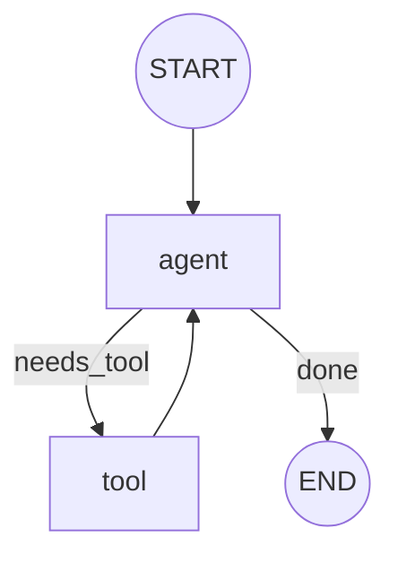

# Quick Start

The shortest path from zero to a running TinyAgents graph, plus the crate layout
you will navigate as you go deeper. TinyAgents is a recursive language-model
(RLM) harness for Rust — see [Recursion and RLM](Recursion-and-RLM) for what
that means once you are up and running.

## Install From crates.io

Add the crate to your project. The hosted OpenAI (and OpenAI-compatible)
provider is compiled in by default and the build stays offline until you make a
call:

```sh
cargo add tinyagents
```

### Optional features

Two Cargo features gate the heavier optional backends — both off by default, so
the base build stays small:

- `sqlite` — the embedded `SqliteCheckpointer` durable graph checkpoint backend.
- `repl` — the embedded Rhai-backed `.ragsh` session runtime.

Enable the ones you need, for example durable SQLite checkpoints:

```sh
cargo add tinyagents --features sqlite
```

To use a hosted model, export your key (and optionally point at a different
model or base URL):

```sh
export OPENAI_API_KEY=...
export OPENAI_MODEL=gpt-4.1-mini          # optional
export OPENAI_BASE_URL=https://api.openai.com/v1   # optional
```

The same adapter powers other providers (Anthropic, Ollama, DeepSeek, Groq,
xAI, OpenRouter, Together, Mistral, and compatible endpoints) through provider
specs and helper constructors. See [Providers](Providers).

- crates.io: <https://crates.io/crates/tinyagents>
- docs.rs: <https://docs.rs/tinyagents>

## Clone, Test, And Run

To work against the source or run the bundled examples, clone the canonical
repository:

```sh
git clone https://github.com/tinyhumansai/tinyagents.git
cd tinyagents
cargo test
```

Useful local checks (these mirror CI):

```sh
cargo fmt --check
cargo clippy --all-targets -- -D warnings
cargo build --all-targets
cargo test
```

### Run the local graph example

The basic graph example needs no provider credentials and runs fully offline:

```sh
cargo run --example basic_graph
```

It threads typed Rust state through a small two-node graph, routes conditionally
after the `agent` node, and exits when the state no longer needs the tool:



### Run an OpenAI-backed example

OpenAI-backed examples need `OPENAI_API_KEY`:

```sh
export OPENAI_API_KEY=...
cargo run --example openai_chat
```

Other offline examples include `complex_graph`, `durable_graph`,
`agent_loop_tools`, `rag_blueprint`, and `subconscious_loop` (a fully offline
autonomous closed-loop agent with a subconscious steering layer); hosted
examples include `openai_tools`, `openai_structured`, `openai_graph_agent`,
`orchestrator_subagents`, and `openai_self_blueprint`. See [Examples](Examples).

## Crate Layout: The Five Surfaces

TinyAgents is organized around five surfaces. Knowing where each lives makes the
source easy to navigate:

- `src/harness/` — **Harness**: provider-neutral model calls, typed tools,
  middleware, structured output, streaming, usage/cost, retry/limits, cache,
  memory/embeddings, sub-agents, steering, summarization, and testkit doubles.
- `src/graph/` — **Graph runtime**: durable typed state graphs with `START`/
  `END`, nodes, edges, conditional routing, commands, `Send` fanout,
  reducers/channels, checkpoints, interrupts, subgraphs, and topology export.
- `src/registry/` — **Registry**: the named capability catalog (models, tools,
  agents, graphs, stores, middleware, policy) that `.rag`/`.ragsh` bind by name.
- `src/language/` — **Expressive language `.rag`**: declarative, side-effect-free
  blueprints that compile (lexer → parser → compiler) into the same runtime.
- `src/repl/` — **REPL language `.ragsh`**: imperative, capability-bound
  interactive orchestration — the RLM/CodeAct loop surface.

Supporting paths:

- `examples/` — runnable examples (offline and OpenAI-backed).
- `docs/spec/` — contributor-facing system specification.
- `wiki/` — this GitHub wiki source.

## Next Steps

- [Recursion and RLM](Recursion-and-RLM) — the execution model that makes
  TinyAgents an RLM harness, with the concrete recursive surfaces and research
  lineage.
- [Examples](Examples) — work through the runnable examples, including the
  self-authoring `.rag` blueprint demos.
- [Architecture](Architecture) — how the five surfaces compose end to end.
