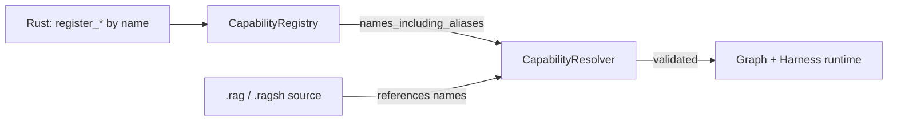

# Registry

The **registry** (`src/registry/`) is TinyAgents' named capability catalog — the
third of the five surfaces in the [Architecture](Architecture.md). It is the
piece that makes recursion *resolvable*: every model, tool, graph, router, and
reducer is registered under a **name**, and the declarative `.rag` and
imperative `.ragsh` languages bind to those names rather than to Rust types. That
indirection is exactly what lets a model spawn a sub-agent or sub-graph it never
hardcoded — it references a name, and the registry resolves it to a real,
allow-listed capability. See [Recursion and RLM](Recursion-and-RLM.md).

The registry is deliberately **explicit**. It is not a hidden global runtime: you
own one per application, test, tenant, workspace, or server. It does not execute
graph nodes or call providers — it answers "which capabilities exist, under what
names, and is this name allowed?"

## What the registry holds

The implemented core has three submodules:

- `registry::component` — identity and discovery types.
- `registry::capability` — the name-addressable `CapabilityRegistry`.
- `registry::catalog` — the offline model catalog (prices, context windows,
  capabilities).

### Component identity (`registry::component`)

Three types describe *what* a registered capability is, independent of any live
handle (they serialize, diff, and render in a UI long after the registering
process exits):

- `ComponentId(String)` — a stable, durable identifier. It is a newtype over the
  registered **name** (e.g. `"gpt-4o"`, `"lookup_user"`), not a Rust type path,
  so a capability survives module moves, renames, and serialization.
- `ComponentKind` — the kind that *partitions the namespace*. Lookups, duplicate
  detection, aliasing, and discovery are all scoped by kind, so `(Model, "x")`
  and `(Tool, "x")` are independent entries. Variants:

  There are **11** variants (`ComponentKind::ALL`), each with a stable
  `as_str` label:

  | Kind | Stores | Status |
  | --- | --- | --- |
  | `Model` | `Arc<dyn ChatModel<State>>` | executable handle |
  | `Tool` | `Arc<dyn Tool<State>>` | executable handle |
  | `Graph` | `Blueprint` (a `.rag` graph) | serializable value |
  | `Agent` | `Arc<dyn HarnessAgent>` | executable handle |
  | `Router` | name-only descriptor | presence only |
  | `Reducer` | name-only descriptor | presence only |
  | `Store` | name-only descriptor | reserved |
  | `Middleware` | name-only descriptor | `"middleware"` |
  | `Checkpointer` | name-only descriptor | `"checkpointer"` |
  | `TaskStore` | name-only descriptor | `"task_store"` |
  | `Listener` | name-only descriptor | `"listener"` |

- `ComponentMetadata { id, kind, description, tags, aliases }` — discovery / UI
  metadata. Every registration records one (even name-only ones, where the
  description and tags start empty); it is the **source of truth for presence**.

> The broader registry *spec* (`docs/modules/registry/README.md`) anticipates
> first-class stores, middleware, listeners, and an event bus. Today `Store`,
> `Middleware`, `Checkpointer`, `TaskStore`, and `Listener` are reserved
> name-only kinds (their executable forms live in the harness/graph runtime);
> document and use what exists. (`Agent`, by contrast, is now an executable
> kind — see below.)

### The capability registry (`registry::capability`)

`CapabilityRegistry<State = ()>` is the name-addressable catalog. It is generic
over the application `State` because models and tools are generic over it;
`State = ()` is the common stateless default. Storage is partitioned by kind:
models, tools, and executable agents keep live handles, graphs keep a
serializable `Blueprint`, and routers/reducers (plus the reserved store kind)
are name-only descriptors. (Agents are state-decoupled — they receive a mapped
prompt, not the registry's `State` — so the agent map is independent of the
`State` generic.) The `meta` map — keyed by `(kind, canonical name)` — is the
uniform presence index behind `has` and `names`.

It is intentionally **distinct** from the harness' per-run `ModelRegistry` and
`ToolRegistry` (which are executable stores). The `CapabilityRegistry` is the
*catalog* that declarative source is validated against.

**Registering capabilities:**

```rust
let mut reg = CapabilityRegistry::<()>::new();
reg.register_model("gpt-4o", model)?;     // duplicate name -> error
reg.register_tool(tool)?;                  // keyed by Tool::name()
reg.register_graph_blueprint("triage", blueprint)?;
reg.register_agent(agent)?;                // keyed by HarnessAgent::name()
reg.register_router("route_by_intent")?;   // name-only descriptor
reg.register_reducer("append_messages")?;  // name-only descriptor
reg.alias(ComponentKind::Model, "fast", "gpt-4o")?;
```

- `register_*` fails with `TinyAgentsError::DuplicateComponent` if the
  `(kind, name)` pair already exists; the `replace_*` variants
  (`replace_model` / `replace_tool` / `replace_graph_blueprint` /
  `replace_agent`) overwrite while preserving any richer metadata already
  attached.
- `register_agent(agent)` registers an executable `Arc<dyn HarnessAgent>` keyed
  by its own `name()`; a `SubAgentNode` resolves it (via `agent(name)`, below) to
  delegate a graph step to a model-driven agent loop.
- `register_descriptor(kind, name)` backs the name-only kinds and is exposed for
  the reserved `Store` kind.
- `alias(kind, alias, target)` declares an alternate name; it validates the
  target exists and the alias is free, then records the alias on the target's
  metadata for discovery.

**Looking things up:**

`model(name)`, `tool(name)`, `graph_blueprint(name)`, and `agent(name)` resolve a
name *or one alias hop* to a live handle/blueprint via `resolve_name`.
`has(kind, name)`
answers presence, `names(kind)` lists canonical names (sorted), and
`names_including_aliases(kind)` lists canonical names *and* aliases — the exact
set declarative source may reference. `metadata(kind, name)` returns the
`ComponentMetadata`.

**Handing off to the runtime:**

- `to_model_registry()` builds a harness `ModelRegistry` from the registered
  models, binding alias names to the same handle.
- `to_tool_registry()` builds a harness `ToolRegistry` (tools are keyed by their
  own schema `Tool::name()`, so tool-level aliases are intentionally not
  propagated — a tool is always invoked under its canonical name).
- `capability_resolver()` builds the language layer's `CapabilityResolver` — the
  bridge described below.

## Introspection and diagnostics {#diagnostics}

The registry owns live handles that cannot be serialized, but its *presence*
metadata can be. `snapshot()` and `diagnostics()` project that metadata for
CLIs, UIs, and audit logs.

**`snapshot()`** returns a serializable `RegistrySnapshot`, sorted by
`(kind, name)` for diff-friendly output. It enumerates both `components` (each a
`ComponentMetadata`) **and** every alias as
`aliases: Vec<AliasBinding { kind, alias, canonical }>`, so a tool can list the
alternate names that resolve to each canonical component. The snapshot
round-trips through serde, and `RegistrySnapshot::to_dot()` renders a Graphviz
DOT view clustering components by kind.

```rust
let mut reg = CapabilityRegistry::<()>::new();
reg.register_model("gpt-4o", model)?;
reg.alias(ComponentKind::Model, "default", "gpt-4o")?;

let snapshot = reg.snapshot();
assert_eq!(snapshot.aliases[0].alias, "default");
assert_eq!(snapshot.aliases[0].canonical, "gpt-4o");
assert_eq!(snapshot.aliases[0].kind, ComponentKind::Model);
```

**`diagnostics()`** returns actionable `RegistryDiagnostic`s (sorted by
`(kind, name)`) that the registration-time duplicate check cannot catch alone:

- **alias-shadows-component** (`DiagnosticSeverity::Warning`) — an alias reuses
  a registered component's name, so the alias is unreachable.
- **dangling-alias** (`Error`) — an alias resolves to an unregistered name.
- **name-reused-across-kinds** (`Warning`) — the same name is registered under
  more than one kind. Registration rejects same-`(kind, name)` duplicates, but
  a name shared across *different* kinds is legal and flagged for audits.

```rust
let mut reg = CapabilityRegistry::<()>::new();
reg.register_model("shared", model)?;
reg.register_router("shared")?; // legal: a different kind

let diags = reg.diagnostics();
assert_eq!(diags[0].name, "shared");
assert!(diags[0].message.contains("multiple kinds"));
```

A registry built entirely through the public API — where `alias()` is
fail-closed against shadowing and dangling targets — always reports clean
diagnostics.

## Binding `.rag` / `.ragsh` capabilities by name

This is the registry's reason to exist. `CapabilityResolver::from_registry(reg)`
(in `language::compiler`) snapshots `names_including_aliases` for every kind into
allow-lists:

```rust
Self {
    models:    reg.names_including_aliases(Model),
    tools:     reg.names_including_aliases(Tool),
    subgraphs: reg.names_including_aliases(Graph),
    routers:   reg.names_including_aliases(Router),
    reducers:  reg.names_including_aliases(Reducer),
    node_kinds: DEFAULT_NODE_KINDS, // model, tool, ...
}
```

When a `.rag` blueprint or a `.ragsh` program names a model, tool, subgraph,
router, or reducer, the compiler checks it against these allow-lists
(`bind_blueprint`, `bind_capabilities_with_registry`). An unknown reference is a
compile error — *before* anything runs. This is what makes **agent-authored**
source safe: a model can emit a `.rag` blueprint, but it can only wire together
capabilities a human already registered and allowed. Because graphs are
registered as `Graph` components, a blueprint can reference another blueprint by
name as a **subgraph** — the registry is where graph-runs-graph recursion gets
its names. The resolver also supports incremental `allow_model` / `allow_tool` /
`allow_subgraph` / `allow_router` / `allow_reducer` extensions for tests and
controlled escalation.



## The model catalog (`registry::catalog`)

The model catalog is an **offline snapshot** of provider model metadata — not a
live source of truth. It gives TinyAgents deterministic behavior for cost
estimates, context-window checks, capability discovery, model-picker UIs, tests,
and request validation *before* a provider call. A checked-in seed snapshot
(`docs/modules/registry/model-catalog.snapshot.json`) is compiled into the crate.

- `ModelCatalog::seed()` loads the bundled snapshot; `from_json` / `from_snapshot`
  load a custom one. `get(provider, model_id)` and `get_by_model_id(model_id)`
  resolve an entry by exact id or alias; `snapshot()` exposes the raw
  `ModelCatalogSnapshot` and `models()` the full entry slice.
- `ModelCatalogSnapshot` carries `schema_version`, `snapshot_id`, `created_at`,
  `currency`, `unit`, an optional `description`, provenance `sources` (name / url
  / `retrieved_at`), and the `models` list.
- `ModelCatalogEntry` describes one model: `provider`, `model_id`, `aliases`,
  `mode`, `max_input_tokens` / `max_output_tokens`, optional `deprecation_date`,
  `pricing`, `capabilities`, a `source` identifier with optional `source_url`,
  and a `raw` JSON `Value` that preserves the upstream payload verbatim for
  fields not modeled above.
- `ModelPricing` gives per-token input/output prices plus cache-read,
  cache-creation, audio, and reasoning rates.
- `ModelCapabilities` is the feature matrix: `streaming`, `tool_calling`,
  `parallel_tool_calling`, `json_schema`, `system_messages`, `vision`,
  `audio_input` / `audio_output`, `pdf_input`, `prompt_caching`, `reasoning`.

The catalog is metadata only — it never calls a provider. See
[Providers](Providers.md) for the live model surface and
`docs/modules/registry/model-catalog.md` for snapshot provenance rules.

## When to use the registry

Use a `CapabilityRegistry` whenever capabilities must be referenced **by name**:
to compile and validate `.rag` blueprints or `.ragsh` programs, to let one agent
or graph spawn another it did not hardcode, to power a discovery UI over
available models/tools/graphs, or to hand a curated, allow-listed set of models
and tools to a harness. Use the **model catalog** whenever you need offline cost
or capability facts about a model without a network call.

## See also

- [Architecture](Architecture.md) — the five surfaces and how they compose.
- [Graph Runtime](Graph-Runtime.md) — what registered `Graph` blueprints become.
- [Recursion and RLM](Recursion-and-RLM.md) — name-binding as the substrate for
  self-authoring and sub-agent/sub-graph recursion.
- Module spec: `docs/modules/registry/README.md`, `design.md`,
  `model-catalog.md`.
